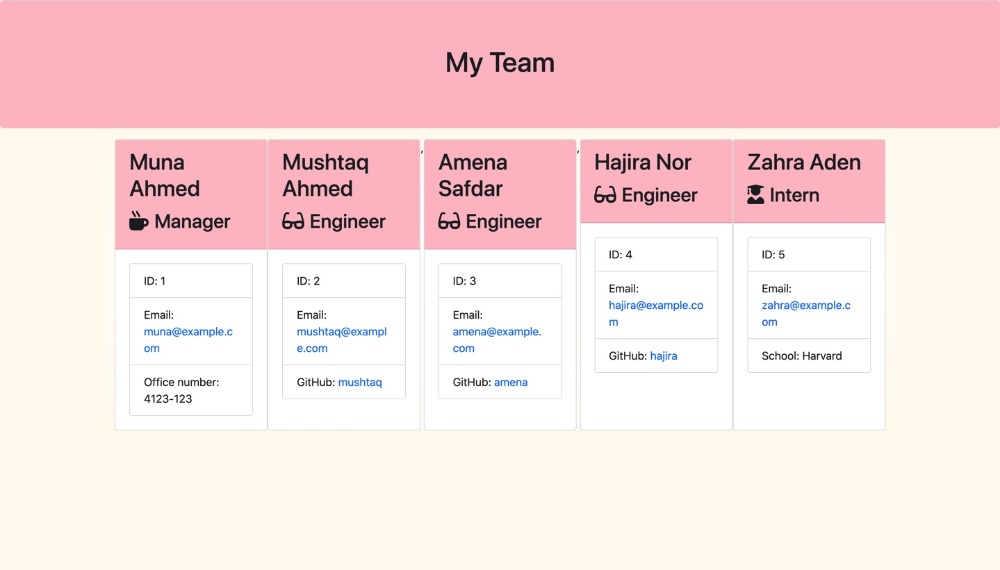

# teamprofilegenerator

## Deployed Image

## Table of Contents 

* [Demo](#demo)

* [Description](#description)

* [Installation](#installation)

* [Functionally](#functionally)

## Demo
 

The demo isn't able to switch screens, so the image above is the final result. 

## Description
An interactive team page generator on the Command Line, made using Node.js. This app generates an html page displaying empoylees cards. 

## Installation
Clone to VS Code. Open a terminal and "npm install". To run the appication type "node app.js". 

## Functionally
The program will ask you simple questions to generate each employee card based on three role types: Manager, Engineer, and Intern.
